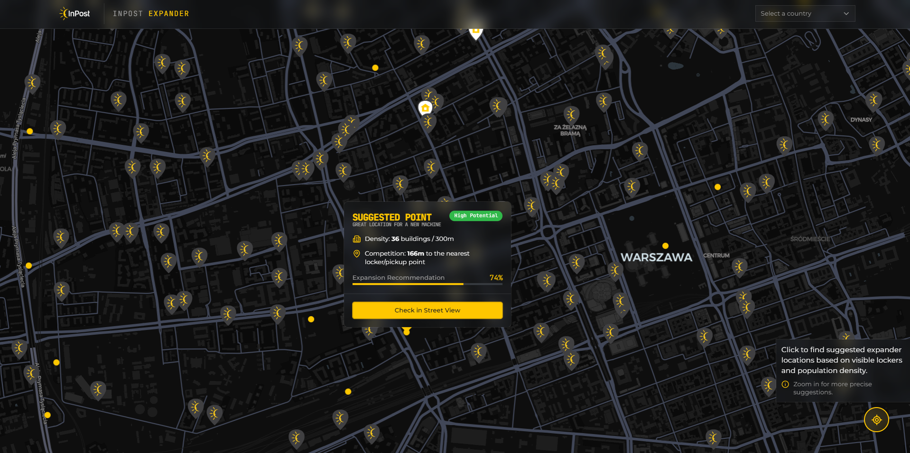
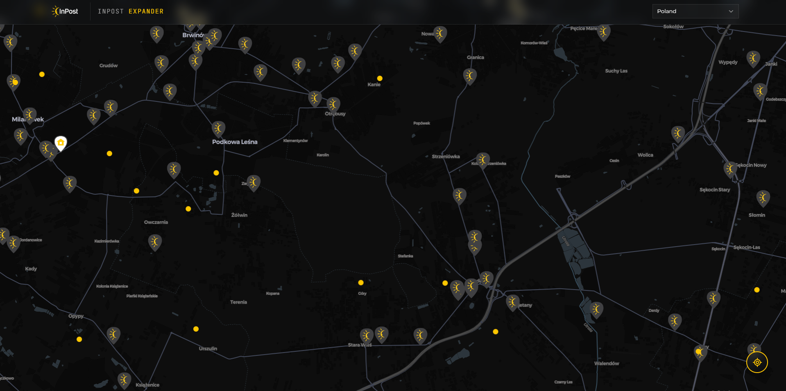

# 📦 InPost Expander – Expansion Analysis System

Hello! Thank you for taking the time to review my solution. This project is more than just a map with pins - it is a data-driven approach to answering the question: _"Where should the next InPost locker be placed?"_

I built this application as a **Turbo Monorepo**, combining the speed of **Vite + React** with the robustness of **Fastify** and the analytical power of **OpenStreetMap**.

## 🚚 Getting Started

### Prerequisites:

- Node.js (v20.6.0 or newer – required for native .env file support)

- pnpm (Recommended package manager) `npm install -g pnpm`

- Docker (To quickly spin up the database)

### Clone the repository:

```bash
git clone https://github.com/mariusz-smajdor/inpost-expander.git
```

### Initial Setup

#### Environment Variables:

- Rename the `example.env` file in the root directory to `.env`.

- (Note on Security: Please note that while the .env file contains database credentials, these are intended for a local development environment only (using the provided Docker setup). In a production scenario, these would be managed via secure secrets management (like AWS Secrets Manager or GitHub Secrets) and never committed to the repository.)

#### Database:

```bash
docker-compose up -d          # Starts PostgreSQL with PostGIS
pnpm install                  # Installs dependencies across the monorepo
cd apps/server
pnpm --filter server db:push  # Syncs Prisma schema with the database
```

#### Sync InPost Data:

```bash
pnpm --filter server db:generate
pnpm --filter server db:sync
```

## 🏃‍♂️ Running the project

### Development

```bash
pnpm dev
```

- Client: `http://localhost:5173`
- Server: `http://localhost:3000`

### Production Build

```bash
pnpm build
pnpm start
```

## 🔄 Data Synchronization & Architecture Strategy

One of the core architectural decisions in this project was to implement a dedicated data synchronization layer between InPost's public API and my local spatial database.

### How it works:

The project includes a specialized synchronization script (db:sync) that:

1. Fetches the entire network of lockers directly from the InPost API.

2. Maps and transforms the raw JSON data into a structured relational format.

3. Geolocates each point using PostGIS geography types for high-precision spatial analysis.

### Why this approach?

- Decoupling & Performance: Relying on live API calls for every map movement would be slow and inefficient. A local database allows for sub-millisecond query responses.

- Geospatial Power: Standard APIs don't support complex spatial logic. By moving data to PostgreSQL/PostGIS, we can perform advanced operations like ST_DWithin and ST_Distance to calculate expansion scores in real-time.

- API Resilience: We avoid hitting InPost's rate limits and ensure the application remains fully functional even if the external API is temporarily unavailable.

- Data Consistency: Having a local "source of truth" allows us to normalize the data and ensure that our Business Intelligence logic is always working with a predictable and clean dataset.

## 🔍 Expansion Logic & Spatial Analysis

The heart of this project is a custom Spatial Scoring Algorithm powered by PostGIS. Instead of simple markers, the system generates a grid of potential locations and evaluates them based on real-time urban data.

### How the Scoring Works:

When you click "Find Expanders," the system runs a complex `prisma.$queryRaw` to calculate the potential of the current area:

1. **Residential Density (300m Radius):** The algorithm scans for OpenStreetMap buildings within a **300-meter** radius of each point. Each residential building found increases the `buildingDensity` value.

2. **Cannibalization Prevention (150m Buffer):** To ensure optimal network growth, any point located within **150 meters** of an existing InPost Locker is automatically discarded.

3. **The Score Formula:** $$\text{Score} = \text{buildingDensity} \times \text{distanceToNearest}$$ This formula prioritizes "white spots"—areas with high population density that are at least 150m away from the current network, while still being within a reachable city grid.

### Why this approach?

- Hyper-local Proximity: A 300m radius represents the "last mile" sweet spot where customers feel the locker is "just around the corner."

- Data-Driven Decisions: By using `ST_DWithin` and `ST_Distance` on geography types, the system provides accurate metric distances, accounting for the Earth's curvature.



## 📸 Use Case Scenarios

To better demonstrate the system's capabilities, I have prepared several scenarios:

1. **"White Spots" on the Map:** Identifying areas with many apartment blocks but zero nearby lockers. This is our top priority.



2. **Street View Verification:** Integrated Google Street View allows you to verify if there is physical space for a locker at the suggested spot with one click.


## A note

I treat this project as an MVP. Given more time, I would implement pedestrian traffic density analysis and integrate data from competitor locker networks. I would be happy to discuss these ideas further during our interview!
